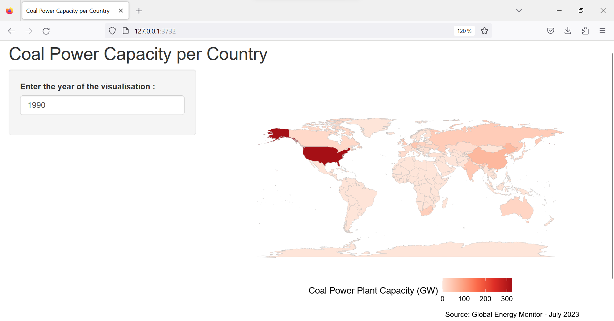

# Coal-capacity-visualisation

This is shiny web app in an R package that can display the coal power plant capacity for all countries on a map, with a text selector to choose the year to display.

## The Data

The Dataset is delivered by the Global Energy Monitor in July 2023. It can be found [here](https://globalenergymonitor.org/projects/global-coal-plant-tracker/download-data/).
The Dataset is assumed complete, which means that it contains all the power plants on Earth. 
This applications takes into account operating, retired and mothballed  plants.

## Time Period Covered
The application is supposed accurate for every year before 2022 but not after as it does not cover plants in construction or permited.

## Launch the Application

1. Download the dataset [here](https://globalenergymonitor.org/projects/global-coal-plant-tracker/download-data/), paste it in the directory "app_src/data", with name "Global-Coal-Plant-Tracker-July-2023.xlsx".

2. Open the project in RStudio, use the "Run app" button, available when editing the file "app_src/ui.R" or "app_src/server.R" 
